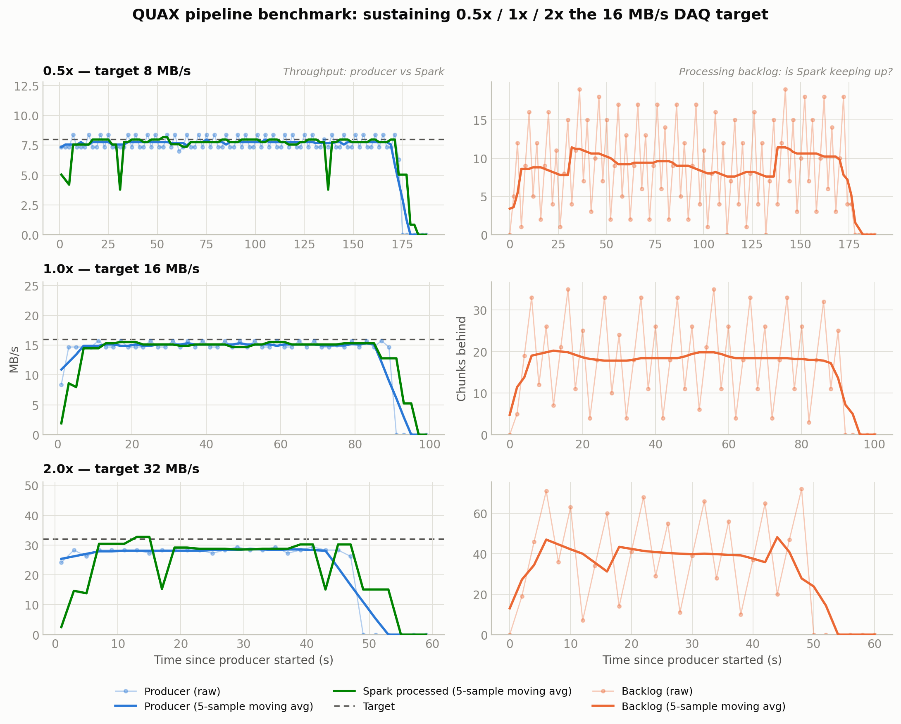

# QUAX streaming pipeline

Real-time FFT power-spectrum monitoring for the QUAX experiment: S3 → Kafka → Spark (distributed across `master`/`worker1`/`worker2`) → Kafka → live dashboard.

## Run

```bash
ssh master
cd Project
./run.sh start --rate 1.0   # starts processor, producer, dashboard
./run.sh status             # check what's running
./run.sh stop                # stop everything
```

Logs: `/tmp/quax_logs/{streaming_job,producer,bokeh}.log`.

From your laptop, forward the dashboard port: `ssh -L 5006:localhost:5006 master`, then open `http://localhost:5006/dashboard`.

## Flags

Passed through to `producer.py` via `run.sh start`:
- `--rate` — multiplier on the real 16MB/s DAQ throughput (default 1.0; e.g. `--rate 2.0` streams at 32MB/s)
- `--chunk-mb` — per-channel chunk size sent per Kafka message (default 1)
- `--n-pairs` — stop after N file-pairs instead of looping forever

## Dashboard

Ingestion throughput, processing backlog (is Spark keeping pace with the producer, or falling behind?), live power spectrum (latest batch + cumulative run average), and a pipeline topology diagram — pulled Kafka/Spark health plus pushed per-chunk worker routing, updated live.

## Processing

`streaming_job.py` micro-batches chunks off `quax_stream` (up to 8 chunks or a short wait, whichever comes first) into one Spark job per batch, so work actually fans out across both workers instead of one chunk at a time. Its Kafka consumer group is `quax-processor` — its committed offset vs. the topic's latest offset is what the dashboard's backlog graph reads.

## Results

Benchmarked against the three required operating points — the nominal 16MB/s DAQ throughput plus 0.5x and 2x — each run streaming 20 file-pairs (640 chunks), tracked via `quax-processor`'s committed Kafka offset vs. `quax_stream`'s latest.

| Rate | Target throughput | Chunks processed | Max backlog | Result |
|---|---|---|---|---|
| 0.5x | 8 MB/s | 640/640 | 19 chunks | Sustained, drained to 0 |
| 1.0x | 16 MB/s | 640/640 | 35 chunks | Sustained, drained to 0 |
| 2.0x | 32 MB/s | 640/640 | 72 chunks | Sustained, drained to 0, no OOM |

Throughput is measured independently on both sides: producer→Kafka (end-offset growth) and Spark's processing rate (the `quax-processor` group's committed-offset growth). The two curves coincide at every rate — direct evidence the processor sustains the producer. Spark's own view is available live at `master:8080` (cluster) and `master:4040` (running app, one job per micro-batch) while the pipeline runs.



Backlog is a genuine sawtooth — Spark commits in discrete micro-batches, sampled every 2s — so the moving average is what actually shows the trend: flat at every rate, never climbing. Raw logs, the plotting script, and this figure are in `benchmarks/`.
